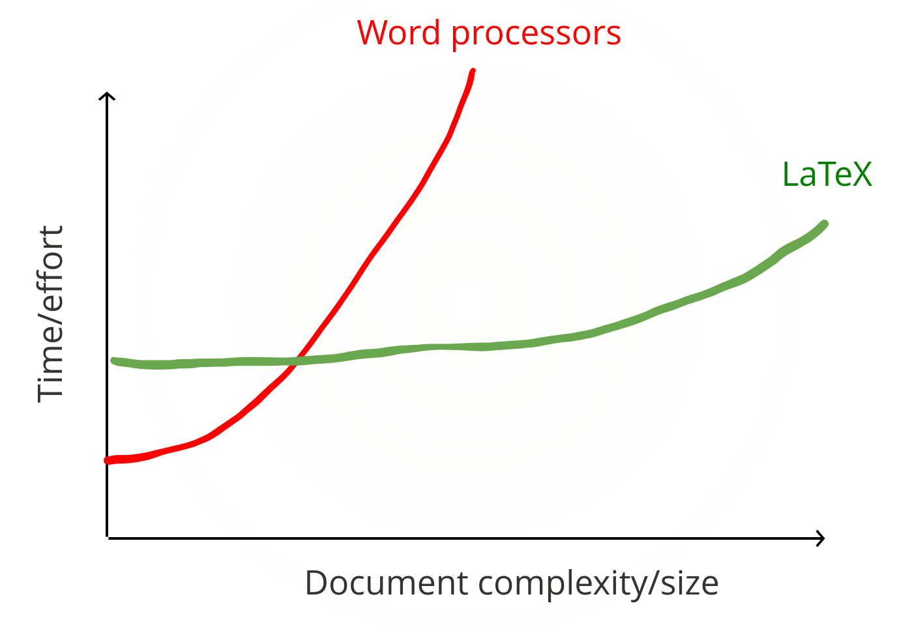

<!-- PROJECT SHIELDS -->

    
     
    

<!-- PROJECT LOGO -->
 

    
    <h1 align="center">Intro to LaTeX Workshop</h1>
    <h2 align="center">Leeds Institute for Data Analytics (LIDA)</h2>

## Author

* Dr Patricia Ternes
  * Research Fellow, School of Geography, University of Leeds, UK
  * [More information](https://patricia-ternes.github.io/)

## What is LaTeX

*"LaTeX, which is pronounced «Lah-tech» or «Lay-tech» (to rhyme with «blech» or «Bertolt Brecht»), is a document preparation system for high-quality typesetting."* 

[Definition from here](https://www.latex-project.org/)

## LaTeX features

* Typesetting journal articles, technical reports, books, and slide presentations.
* Control over large documents containing sectioning, cross-references, tables and figures.
* Typesetting of complex mathematical formulas.
* Advanced typesetting of mathematics with AMS-LaTeX.
* Automatic generation of bibliographies and indexes.
* Multi-lingual typesetting.
* Inclusion of artwork, and process or spot colour.
* Using PostScript or Metafont fonts.

[Definition from here](https://www.latex-project.org/)

## Learning curve

