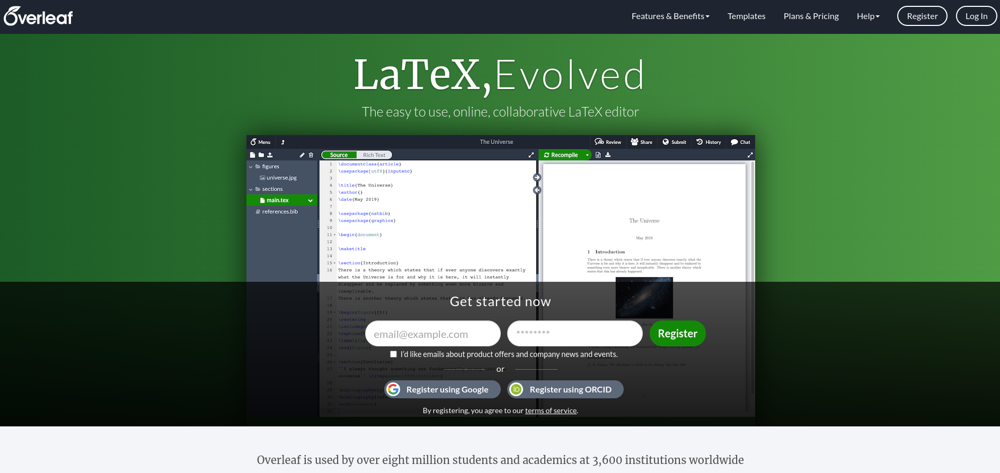
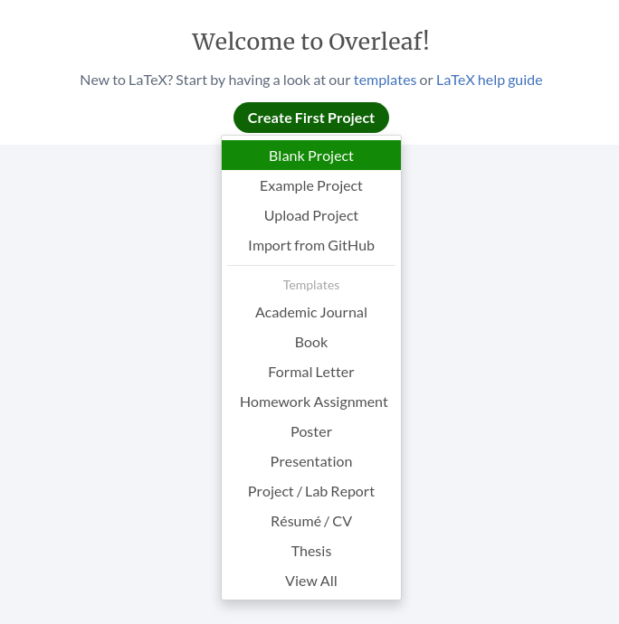
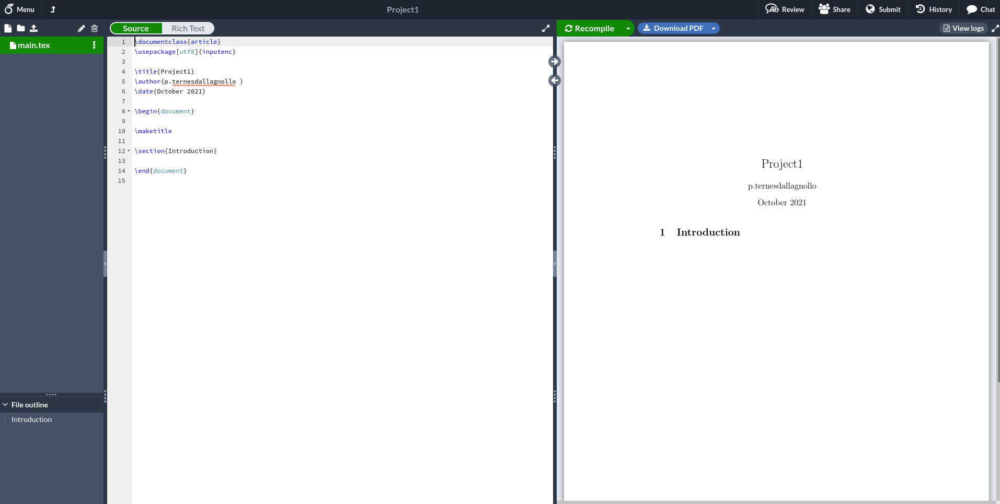

<!-- PROJECT SHIELDS -->
<p align="center">
    <a href="https://github.com/patricia-ternes/LIDA-LaTeX-workshop/graphs/contributors" alt="Contributors">
        </a>
     <a href="https://github.com/patricia-ternes/LIDA-LaTeX-workshop/blob/main/LICENSE" alt="License">
        </a>
    <a href="https://lida.leeds.ac.uk/"  alt="LIDA page">
        </a>
</p>

<!-- PROJECT LOGO -->
<br />
<p align="center">
    
    <h1 align="center">Intro to LaTeX Workshop</h1>
    <h2 align="center">Leeds Institute for Data Analytics (LIDA)</h2>
</p>

## Author

* Dr Patricia Ternes
  * Research Fellow, School of Geography, University of Leeds, UK
  * [More information](https://patricia-ternes.github.io/)

## Additional Materials

The workshop has two additional materials:

* [Presentation](https://patricia-ternes.github.io/Documents/Teaching/Trainings/03-LIDA_LaTeX/presentation_intro_latex.html)
* [TeX project](inputs/tex_project/)

## Table of Contents

- [Introduction](#introduction)
  - [What is LaTeX](#what-is-latex)
  - [LaTeX features](#latex-features)
  - [Learning curve](#learning-curve)
  - [What I can do with LaTeX?](#what-i-can-do-with-latex)
- [Overleaf](#overleaf)
  - [First project](#first-project)
- [Preamble](#preamble)
  - [Document classes](#document-classes)
  - [Packages](#packages)
  - [Standard titles](#standard-titles)
- [Text](#text)
- [Sectioning commands](#sectioning-commands)
- [Table of contents](#table-of-contents-1)
- [Lists](#lists)
  - [Unordered lists](#unordered-lists)
  - [Description lists](#description-lists)
  - [Ordered lists](#ordered-lists)
- [Figures](#figures)
- [Tables](#tables)
- [Mathematical environment](#mathematical-environment)
  - [Math modes](#math-modes)
    - [Inline math mode](#inline-math-mode)
    - [Unordered math mode](#unordered-math-mode)
    - [Ordered math mode](#ordered-math-mode)
    - [Array environment](#array-environment)
  - [Some functions](#some-functions)
  - [LaTeX mathematical symbols](#latex-mathematical-symbols)
- [Bibliography with BibTeX](#bibliography-with-bibtex)
  - [The BibTeX file](#the-bibtex-file)
- [Final Tips:](#final-tips)
  - [Special Characters!](#special-characters)
  - [Spaces](#spaces)
    - [New Paragraph](#new-paragraph)
    - [Line break](#line-break)
    - [Page break](#page-break)
    - [Horizontal blank spaces](#horizontal-blank-spaces)
    - [Vertical blank spaces](#vertical-blank-spaces)

## Introduction

### What is LaTeX

*LaTeX, which is pronounced «Lah-tech» or «Lay-tech» (to rhyme with «blech» or «Bertolt Brecht»), is a document preparation system for high-quality typesetting.* 

[Definition from here](https://www.latex-project.org/)

### LaTeX features

* Typesetting journal articles, technical reports, books, and slide presentations.
* Control over large documents containing sectioning, cross-references, tables and figures.
* Typesetting of complex mathematical formulas.
* Advanced typesetting of mathematics with AMS-LaTeX.
* Automatic generation of bibliographies and indexes.
* Multi-lingual typesetting.
* Inclusion of artwork, and process or spot colour.
* Using PostScript or Metafont fonts.

[Features from here](https://www.latex-project.org/)

### Learning curve


### What I can do with LaTeX?

* [Book](https://www.overleaf.com/latex/templates/tagged/book)
* [Figures, diagrams and plots](https://texample.net/tikz/examples/)
* [Homework Assignment](https://www.overleaf.com/latex/templates/tagged/homework)
* [Paper](https://www.overleaf.com/latex/templates/tagged/academic-journal)
* [Poster](https://www.overleaf.com/latex/templates/tagged/poster)
* [Presentation](https://www.overleaf.com/latex/templates/tagged/presentation)
* [Thesis](https://www.overleaf.com/latex/templates/tagged/thesis)

## Overleaf

[Overleaf](www.overleaf.com/) is a collaborative online LaTeX editor



### First project

After creating an account, a page with the option `Create First Project` will appear (see image bellow). To create your first `Project` just click on the button, chose one template (here, the `Blank Project`) and give a name for your project.



The next screen is the `Projec` page, see bellow:



This screen is divided in three columns, from left to right:

1. Files
2. Text source
3. Output

Note that you can resize, minimize and maximize columns.

## Preamble

The `Overleaf` automatically adds some elements to your code, even if you start with a blank project. So let's understand these elements.

Everything from line 1 up to line 7 is part of the `Preamble`.

*The [`preamble`](https://latex.wikia.org/wiki/LaTeX_preamble) is the first section of an input file, before the text of the document itself, in which you tell LaTeX the type of document, and other information LaTeX will need to format the document correctly.*

The general syntax of a LaTeX document is

```latex
\documentclass{class}
   … your preamble goes here …

\begin{document}
   … your text goes here …
\end{document}
```

### Document classes

> Line 1: `\documentclass{article}`

The `documentclass` is the first command of a LaTeX document, and identifies the type of document contained in the input file (from [here](https://latex.wikia.org/wiki/List_of_LaTeX_commands#documentclass_command)). The general syntax is

```latex
\documentclass[options]{class}
```

Some standard classes are:

* **article**: For articles in scientific journals, presentations, short reports, program documentation, invitations, ...
* **report**: For longer reports containing several chapters, small books, thesis, ...
* **book**: For books.
* **letter**: For writing letters.
* **beamer**: For writing presentations (see LaTeX/Presentations).

[See more about document classes here](https://en.wikibooks.org/wiki/LaTeX/Document_Structure#Document_classes)

The most common options for the generic document classes are:

 * **Main font size**: `10pt, 11pt, 12pt` (default: `10pt`)
 * **Paper size**: `a4paper, letterpaper, a5paper, b5paper, executivepaper, legalpaper` (default: `letterpaper`*)
 * **Number of columns**: `onecolumn, twocolumn` (default: `onecolumn`)

[See more about document classes options here](https://en.wikibooks.org/wiki/LaTeX/Document_Structure#Document_classes)

### Packages

> Line 2: `\usepackage[utf8]{inputenc}` 

While writing your document, you will probably find that there are some areas where basic LaTeX cannot solve your problem. If you want to include graphics, colored text or source code from a file into your document, you need to enhance the capabilities of LaTeX. Such enhancements are called packages (from [here](https://en.wikibooks.org/wiki/LaTeX/Document_Structure#Packages)). The `usepackage` command tells LaTeX to load packages of environments, commands, and symbols for specific purposes (from [here](https://latex.wikia.org/wiki/Usepackage_(LaTeX_command))).  The general syntax is

```latex
\usepackage[options]{package}
```

The most common packages are:

* `inputenc`: input encoding
* `amsmath`, `amsfonts`: contains a comprehensive set of mathematical symbols; particularly handy for rendering matrices
* `graphicx`: to include graphics (images)
* `xcolor`: to use colours in a wide variety of ways, including rgb, cmyk, hsb
* `fancyhdr`: useful for customizing the headers and footers in your document
* `hyperref`: to automatically insert hyperlinks into the document

### Standard titles

> Line 4: `\title{ }`

> Line 5: `\author{ }`

> Line 6: `\date{ }`

The standard classes provide four storing commands that are used to automatically create the title. The storing commands are

* **\title**
* **\author**
* **\thanks**: footnote
* **\date**

> Line 12: `maketitle`

The title is created inside the text area through the command `maketitle`

## Text

```latex
\begin{document}
   … your text goes here …
\end{document}
```

## Sectioning commands

The commands for inserting sections are fairly intuitive. Of course, certain commands are appropriate to different document classes. For example, a book has chapters but an article doesn't (from [here](https://en.wikibooks.org/wiki/LaTeX/Document_Structure#Sectioning_commands)). Some examples:

* `\chapter{chapter name}`: only books and reports
* `\section{section name}`: not in letters
* `\subsection{subsection name}`: not in letters
* `\subsubsection{subsubsection name}`: not in letters
* `\paragraph{paragraph content}`: not in letters

The `\appendix` macro can be used to indicate that following sections or chapters are to be numbered as appendices. For example:

```latex
\section{first section}
    ... some text ...

\section{second section}
    ... some text ...

\appendix
\section{first appendix}
    ... some text ...

\section{second appendix}
    ... some text ...
```

## Table of contents

All auto-numbered headings get entered in the Table of Contents (also for list and figures) automatically. If you want to display the tables of content, just add the command.

* `\listoffigures`
* `\listoftables`
* `\tableofcontents`

## Lists

Typesetting lists is a large topic because LaTeX lists are extremely configurable, enabling creation of an enormous variety of list types and structures (from [here](https://pt.overleaf.com/learn/latex/Lists)). Bellow some standards lists are presented. If you want configure and customize your lists see more [here](https://pt.overleaf.com/learn/latex/Lists).

### Unordered lists

```latex
\begin{itemize}
    \item ... some text ...
    \item ... some text ...
    \item ... some text ...
\end{itemize}
```

### Description lists

```latex
\begin{description}
    \item [some description] ... some text ...
    \item [some description] ... some text ...
    \item ... some text ...
\end{description}
```

Note that the `[description]` is optional.

### Ordered lists

```latex
\begin{enumerate}
    \item ... some text ...
    \item ... some text ...
    \item ... some text ...
\end{enumerate}
```

## Figures

To include images in your text you need include a package in the `preamble`. I recommend using the package `graphicx`.

```latex
\usepackage{graphicx}
```

The image is inserted using the command `\includegraphics`. The ideal is to use the `figure` environment to to properly include the image in the text. The complete command is

```latex
\begin{figure}[position option]
    \centering
    \includegraphics[figure options]{file path}
    \caption{Caption.}
    \label{fig:my_label}
\end{figure}
```

Some figures options are (from [here](https://pt.overleaf.com/learn/latex/Inserting_Images#Changing_the_image_size_and_rotating_the_picture)):

* `scale`
* `width`
* `height`
* `angle`

Some size units are (see all [here](https://pt.overleaf.com/learn/latex/Inserting_Images#Reference_guide)):

* `pt`
* `mm`
* `cm`
* `\linewidth`
* `\textheight`


Figures are [floats](https://en.wikibooks.org/wiki/LaTeX/Floats,_Figures_and_Captions) (containers for things in a document that cannot be broken over a page) and the LaTeX will  automatically define the best location for the image. However, if we don't give some "tips" on how to do this, the end result can be very different from what you expect. Fortunately, we can add some options to help LaTeX define the best position for the image.

Some position options are (from [here](https://pt.overleaf.com/learn/latex/Inserting_Images#Positioning)):

* `h`: Place the float here, i.e., approximately at the same point it occurs in the source text (however, notexactly at the spot)
* `t`: Position at the top of the page.
* `b`: Position at the bottom of the page.
* `p`: Put on a special page for floats only.
* `!`: Override internal parameters LaTeX uses for determining "good" float positions.
* `H`: Places the float at precisely the location in the LaTeX code. Requires the float package, though may cause problems occasionally. This is somewhat equivalent to h!.

## Tables

The `tabular` environment is the default LaTeX method to create tables. As for including figures, the ideal is to use the `table` environment to to properly include the table in the text. The complete command is

```latex
\begin{table}[position option]
    \centering
    \begin{tabular}{c|c}
       line 1 column 1  &  text: line 1 column 2\\
       line 2 column 1  &  text: line 2 column 2
    \end{tabular}
    \caption{Caption}
    \label{tab:my_label}
\end{table}
```

The number of columns and the alignment is defined as a parameter just after the `tabular`, here was `{c | c}`,  meaning two centralized columns with one vertical line (you can define more - or none - vertical lines). The number of columns is related with the number of letters, and The column alignment is defined by letters:

* `l`: left
* `c`: centre
* `r`: right

To create a new line just add the `\\` command to the end of the previous line and write a new line. To drawn a horizontal line, use the `\hline` command after the `\\`.

In addition, there are additional packages and advanced commands that allow greater control over the table layout. See [here](https://pt.overleaf.com/learn/latex/Tables) for more information on tables.

## Mathematical environment

If your document requires only a few simple mathematical formulas, plain LaTeX has most of the tools that you will ever need. If you are writing a scientific document that contains numerous complex formulas some additional packages are required from [here](https://en.wikibooks.org/wiki/LaTeX/Mathematics)). Recommended packages are:

* amsmath or mathtools
* amsfonts

For a complete description about the mathematical environment you can find [here](https://en.wikibooks.org/wiki/LaTeX/Mathematics). Bellow I will summarize some basic concepts.

### Math modes

#### Inline math mode

To type some equation in inline mode, you can use the `$ ... $` delimiters.

```latex
... some text ... $ some equation $ ... some text ...
```

#### Unordered math mode

To type some equation in the unordered math mode, you can use the `\[ ... \]` delimiters.

```latex
... some text ... 
\[
    some equation
\]
... some text ...
```

#### Ordered math mode

To type some equation in the ordered math mode, you can use the `\begin{equation} ... \end{equation}` delimiters.

```latex
... some text ... 
\begin{equation}
    some equation
\end{equation}
... some text ...
```

#### Array environment

To type some equation in the array math mode (like a matrix), you can use the `\begin{array} ... \end{array}` .delimiters.

```latex
\begin{equation}
    \begin{array}{cols} 
        row1 \\ 
        row2 \\ 
        . . .\\
        rowm 
    \end{array}
\end{equation}
```

Note that the array should be used inside a math mode!

### Some functions

* `\frac{numerator}{denominator}`: fraction
* `\sqrt{\frac{a}{b}}`: square roots
* `\sqrt[n]{\frac{a}{b}}`: roots of magnitude `n`
* `^{n}`: powers
* `_{n}`: indices

### LaTeX mathematical symbols

Mathematics has a huge variety of symbols, and they are all available in LaTeX. Bellow some ideas about what is available:

* Greek and Hebrew letters
* math constructs
* Delimiters
* Variable-sized symbols
* Standard Function Names
* Binary Operation and Relation Symbols
* Arrow symbols
* Math mode accents

You can see this [file](https://www.caam.rice.edu/~heinken/latex/symbols.pdf) to find the commands for each symbol.

## Bibliography with BibTeX

To including bibliography using a `bibtex` file is necessary:

1. Create a bibtex file (extension .bib) with the citations.
2. Include `\bibliographystyle{unsrt}` on preamble to define the numbered style.
3. Use the `\cite{bib_key}` command to cite the reference.
4. Insert the `\bibliography{bib_file}` command to print the bibliography.

The syntax is:

```latex
%in the preamble
%--------------------------------
    \bibliographystyle{unsrt}
%--------------------------------

% in the text
    ... some text \cite{bib_key} some text ...

%Where the bibliography will be printed
    \bibliography{bib_file}
```

The standard LaTeX bibliography supports numerical citation. If you need different styles, you can use a different bibliography package that includes different styles. A good example is the `natbib` package, with a syntax like:

```latex
%in the preamble
%--------------------------------
   \usepackage{natbib}
   \bibliographystyle{stylename}
%--------------------------------

% in the text
    ... some text \cite{bib_key} some text ...

%Where the bibliography will be printed
    \bibliography{bib_file}
```

and some styles options:

* dinat
* plainnat
* abbrvnat
* ksfh_nat

See [here](https://pt.overleaf.com/learn/latex/Natbib_bibliography_styles) for more about the `natbib` package, and [here](https://en.wikibooks.org/wiki/LaTeX/Bibliography_Management) for a complete explanation about the LaTeX bibliography.

### The BibTeX file

Some standard templates for organize the references are:

```latex
@article{bib_key1,
    author    = " author 1 and author 2 and author 3",
    title     = "",
    journal   = "",
    volume    = "",  % Optional
    number    = "",  % Optional
    pages     = "",  % Optional
    year      = "XXXX",
    month     = "",  % Optional
    note      = "",  % Optional
}
```

Note that the authors' name are separated by `and`. Furthermore, each BibTeX entry has a unique `bib_key`. The `bib_key` is used as reference to link the citation in the main file with the BibTeX file.

```latex
@book{bib_key2,
    author    = "",
    title     = "",
    publisher = "",
    volume    = "",   % Optional
    number    = "",   % Optional
    series    = "",   % Optional
    address   = "",   % Optional
    edition   = "",   % Optional
    year      = "XXXX",
    month     = "",   % Optional
    note      = "",   % Optional
}
```

You can see more templates [here](https://en.wikibooks.org/wiki/LaTeX/Bibliography_Management#Authors).

## Final Tips:

### Special Characters!

As you may already notice, some characters are not interpreted as a text entrance, they are interpreted as commands. Some common special characters are:


| LaTeX command | Description | Text-mode equivalence |
| ------------- | ----------- | --------------------- |
| `$`             | Delimiter for math mode    | `\$` |
| `%`             | To comment some text       | `\%` |
| `^`             | Superscript (math)         | `\^` |
| `_`             | Subscript (math)           | `\_` |
| `&`             | Table column divisor       | `\&` |
| `{` and `}`     | Used with several commands | `\{` and `\}` |
| `~`             | Single space               | `\~` |
| `\`             | Used with commands         | `\textbackslash` |

See [here](https://en.wikibooks.org/wiki/LaTeX/Special_Characters) to know more about special characters.

### Spaces

The LaTeX have a huge control about the spaces in the output, but some information can be helpfull.

#### New Paragraph

The easeast way to create a new paragraph is by leaving an empty line in the code (see [here](https://www.overleaf.com/learn/latex/Line_breaks_and_blank_spaces)). The syntax is

```latex
First paragraph ...

Second paragraph ...
this line is part of the second paragraph.
```

#### Line break

There are three commands to force a new line:

* `\\`
* `\newline`
* `\hfill \break`

#### Page break

* \clearpage
* \newpage

The difference between them is the way that they handle with floats (like images and tables).

#### Horizontal blank spaces

* `~`: single space
* `\quad` and `\qquad`: spaces in math mode (`\qquad` = 2*`\quad`)
* `\hspace{1cm}`: add a horizontal space of the desired size.
* `\hfill`: add the maximum possible horizontal space.

#### Vertical blank spaces

* `\vspace{1cm}`: add a vertical space of the desired size.
* `\vfill`: add the maximum possible vertical space.
